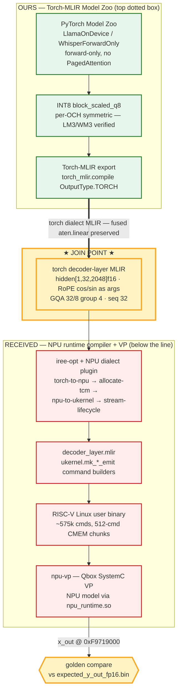

<div align="center">

# 🦈 Zoo

**Torch-MLIR Model Zoo**

**깨끗한 torch-dialect MLIR로 내려가는 온디바이스 PyTorch 모델 주(zoo) —
커스텀 NPU 스택의 프론트엔드 절반. NPU 런타임 컴파일러 + SystemC 가상 플랫폼과
torch-MLIR 경계에서 합류(join)한다.**

*amdsharktank를 **온디바이스 NPU로 뒤집은** 것 — 서버측 추상화를 걷어내고
fused op를 보존하는 lowering 프레임워크.*

`forward-only` · `server_side_op_hits = 0` · `2 GB budget` · `모델 swap = config 한 줄`

[](https://www.python.org/)
[](https://pytorch.org/)
[](https://github.com/llvm/torch-mlir)
[](https://github.com/iree-org/iree)
[](LICENSE)

[**빠른 시작**](#-빠른-시작) ·
[**아키텍처**](docs/ARCHITECTURE.md) ·
[**레시피**](docs/RECIPES.md) ·
[**가이드라인**](docs/GUIDELINES.md)

</div>

---

## 무엇인가?

모델들이 **깨끗한 top-level torch-dialect MLIR**로 내려가도록 작성된 모델 주(zoo)다.
서버측 패턴(paged attention, KV-cache op, vLLM)이 전혀 없어서, 온디바이스 NPU
런타임 컴파일러가 그대로 소비할 수 있다.

이것은 하나의 커스텀 온디바이스 스택("우리만의 amdsharktank")의 **프론트엔드**다:

- **우리 소유** = PyTorch Model Zoo → INT8 양자화 → Torch-MLIR export.
- **런타임** = NPU 컴파일러 dialect 플러그인(IREE 기반) + SystemC NPU 모델 +
  RISC-V 가상 플랫폼 — 소스로 전달받음.
- 두 절반은 **torch-MLIR 경계에서 합류**한다 — 런타임의 손으로 쓴 스텁 layer를
  우리의 실제 export로 교체하면 스택이 하나로 이어진다.

### 무엇을 빼고, 무엇을 남기나

설계 스펙(`torch_mlir_model_zoo.pdf`)이 정한 그대로:

- **뺀 것 = PagedAttention** (+ KV-cache / paging). 서버향 amdsharktank의
  `PagedMHAttention` / `PagedGQAttention`을 온디바이스로 porting하며 제거.
- **남긴 것 = Attention · RMSNorm · MLP · Top-K** — Transformer 기본 4연산.
  Attention은 제거가 아니라 표준 **SDPA(+GQA, causal)로 구현**(`ops/attention.py`).

> ⚠ 흔한 오해: "attention을 뺀다" ✗. 뺀 건 **Paged**Attention(KV-cache/paging)이고,
> attention 자체는 zoo의 핵심 op다.

---

## 🔁 amdsharktank와의 차이

발상은 같고(모델 zoo + PyTorch→MLIR→IREE 계열), **방향은 반대**다 — amdsharktank는
데이터센터 GPU 서빙 스택, 우리는 그것을 온디바이스 NPU용으로 뒤집은 프론트엔드.

| 항목 | amdsharktank | 우리 (torch-mlir-zoo) |
|---|---|---|
| 타깃 HW | AMD GPU (MI300, ROCm), multi-GPU | 온디바이스 NPU, 2 GB, CPU 호스팅 VP (RISC-V) |
| 서버측 패턴 | **기반으로 삼음** (PagedAttention, KV-cache, ThetaLayer, sharding) | **의도적으로 제거** (`server_side_op_hits == 0`) |
| 실행 모델 | prefill/decode 분리, KV cache, sampling | forward-only, 매 position 재계산 |
| export 백엔드 | iree.turbine → **분해** (GPU linalg codegen용) | 백엔드 2개; 합류 백엔드 = `torch_mlir.compile` → **fused `aten.linear` 보존** |
| 컴파일 target | IREE → AMD GPU | torch-MLIR → NPU dialect(`torch-to-npu`) → SystemC NPU VP |
| 규모 | 70B~405B, sharding | 1B급, sharding 없음 |
| 역할 | 모델 라이브러리 + 서빙 스택(전체) | 프론트엔드 프레임워크 — 런타임에 **합류**하는 절반 |

**결정적 3가지:**
1. **추상화 방향 정반대** — sharktank는 서버측 추상화 위에 세워지고, 우리는 그걸
   벗겨 표준 aten만 남긴다. 우리 `ops/`는 sharktank의 `PagedMHAttention` /
   `RMSNormLayer(ThetaLayer)` / `FFN`의 **온디바이스 대체물**.
2. **fused 보존 vs 분해** — 받은 NPU 패스가 fused `aten.linear`를 매치하므로,
   분해하는 turbine이 아니라 `torch_mlir.compile` 백엔드를 써야 합류된다.
3. **완제품 vs 프론트엔드** — sharktank는 모델+서빙 전체, 우리는 "top dotted box"
   프론트엔드로 받은 NPU 런타임+VP에 붙는다.

---

## 🏗 아키텍처

전체 스택과, 우리 프론트엔드가 전달받은 런타임과 만나는 단일 합류점
(초록 = 우리, 빨강 = 전달받음, 파랑 = OSS 그대로, **노랑 = 합류점**):



> **편집 가능한 원본:** [`diagrams/architecture.drawio`](docs/diagrams/architecture.drawio)
> — [draw.io / diagrams.net](https://app.diagrams.net)에서 열기. 2페이지:
> **Stack Architecture**(위)와 **Lowering & Join**(백엔드 선택 → 합류 성공/실패
> 지점). 상세 설명은 [ARCHITECTURE.md](docs/ARCHITECTURE.md).

### 합류를 성립시키는 단 하나의 결정

같은 모델, 두 개의 export 백엔드 — 이 선택이 런타임이 출력을 소비할 수 있는지를
결정한다:

| 백엔드 | `aten.linear` | NPU 런타임과 합류? |
|---|---|---|
| **`torch_mlir.compile(OutputType.TORCH)`** | **보존(fused)** | ✅ `torch-to-npu` 패스가 fused `aten.linear`를 매치 |
| `iree.turbine.aot` | 분해 → `mm`/`bmm` (실측 65/24) | ✗ 패스에 matmul-form 패턴 없음 |

---

## ✨ 특징

- **설계상 온디바이스** — 모든 모델이 `server_side_op_hits == 0`으로 내려감
  (paged-attention / KV-cache / vLLM op 없음), export마다 검증.
- **두 export 백엔드, 동일 시그니처** — `torch_mlir.compile`(fused, 합류 백엔드)와
  `iree.turbine.aot`(core-aten), config 한 줄로 교체.
- **모델 swap 프레임워크** — 좁은 `BaseStage` + config-driven registry;
  모델·백엔드 추가가 프레임워크 코어를 건드리지 않음
  (`git diff main` 코어 = 0줄).
- **2 GB budget 강제** — 횡단 프로파일러가 budget 초과 로드에 경고.
- **양자화는 마지막** — `block_scaled_q8`(per-output-channel symmetric INT8)를
  lowering이 올바른 뒤에만 적용.
- **재사용 단위 op** — `RMSNorm`, `SwiGLU`, `ScaledDotProductAttention`, `TopK`,
  각각 표준 op로 된 순수 `nn.Module`.

---

## 🚀 빠른 시작

```bash
pip install -e .[shark]              # 전용 venv, 시스템 python 금지
pytest                               # zoo 단위 + export 테스트 (21 passed / 3 skipped)

python scripts/run_llama_export.py   # Llama-3.2-1B → torch dialect MLIR + summary.json
python scripts/run_whisper_export.py # Whisper forward-only
```

성공 신호: export의 `summary.json`이 `server_side_op_hits == {}`를 보임.
자세히는 [RECIPES.md](docs/RECIPES.md).

---

## 🧩 구성 요소

| 경로 | 내용 |
|---|---|
| `src/npu_harness_framework/` | 도메인 중립 코어: `interfaces` / `registry` / `pipeline` / `profiler` (~130 LOC) |
| `src/torch_mlir_zoo/ops/` | 단위 op 4종 (Attention / RMSNorm / SwiGLU / TopK) |
| `src/torch_mlir_zoo/models/` | `LlamaOnDevice`, `WhisperForwardOnly` (forward-only) |
| `src/torch_mlir_zoo/exporters/` | 두 백엔드 (`torch_mlir_export`, `iree_turbine_export`) |
| `src/torch_mlir_zoo/analysis/` | `ir_summary` — op 히스토그램 + `server_side_op_hits` |
| `configs/zoo/*.yaml` | op/모델 × 백엔드마다 YAML 1개 — `type` 편집으로 swap |
| `scripts/` | export 드라이버 |

---

## 📊 상태

| 항목 | 상태 |
|---|---|
| 프레임워크 코어 + 온디바이스 모델 + op 4종 | ✅ |
| 두 export 백엔드 | ✅ (합류 백엔드 = torch_mlir) |
| IREE-CPU 수치 검증 (op 4종 + DecoderBlock) | ✅ export→llvm-cpu→run, PyTorch와 max_err ~1e-6 (`tests/test_iree_cpu_numeric.py`) |
| INT8 `block_scaled_q8` | ✅ 검증됨 (별도 관리) |
| 전달받은 런타임 빌드 (opt+plugin, VP, NPU model) | ✅ |
| 캡스톤 frontend join (계약 + 백엔드) | ✅ 확정 |
| 캡스톤 e2e lowering 증명 | ⏳ torch↔torch-mlir ABI skew (torch-mlir 소스빌드 필요) |
| Layer-0 e2e green | ⛔ 런타임팀 `/dev/npu0` 드라이버에 의존 |

---

## 📚 문서

| 문서 | 내용 |
|---|---|
| [ARCHITECTURE.md](docs/ARCHITECTURE.md) | system / software / lowering (3-view + 다이어그램) |
| [RECIPES.md](docs/RECIPES.md) | 재현 가능한 export / build / lowering 명령 |
| [GUIDELINES.md](docs/GUIDELINES.md) | 모델·op·백엔드 추가 규칙 + 엔지니어링 규율 |
| [diagrams/architecture.drawio](docs/diagrams/architecture.drawio) | 편집 가능한 draw.io 원본 (2페이지) |

## 가이드라인 (기여)

전체 규칙: [docs/GUIDELINES.md](docs/GUIDELINES.md). 요약:

- **모델:** 표준 `torch.aten.*`만 — 커스텀 fused 커널 금지, 서버측 추상화 금지.
  lowering이 반드시 `server_side_op_hits == {}`를 보여야 함.
- **새 op / 모델 / 백엔드:** 모듈 + `@register` 한 줄 + YAML 추가.
  프레임워크 코어는 절대 fork 금지.
- **NPU 런타임용 export:** torch-mlir 백엔드 사용 (`aten.linear` 보존).
- **양자화:** `block_scaled_q8`는 마지막 단계 — 메모리 지름길로 쓰지 말 것.
- **규율 (`CLAUDE.md`):** 코딩 전 사고, 최소 코드, 외과적 변경, 검증 가능한 목표.
