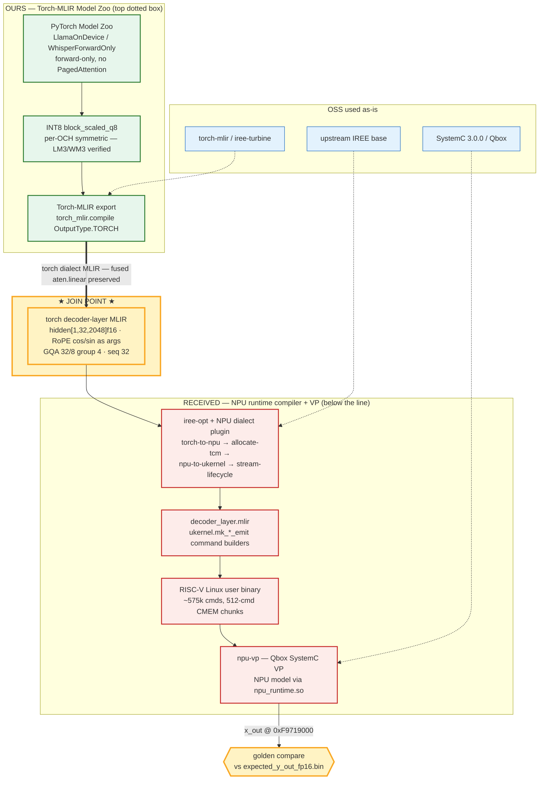
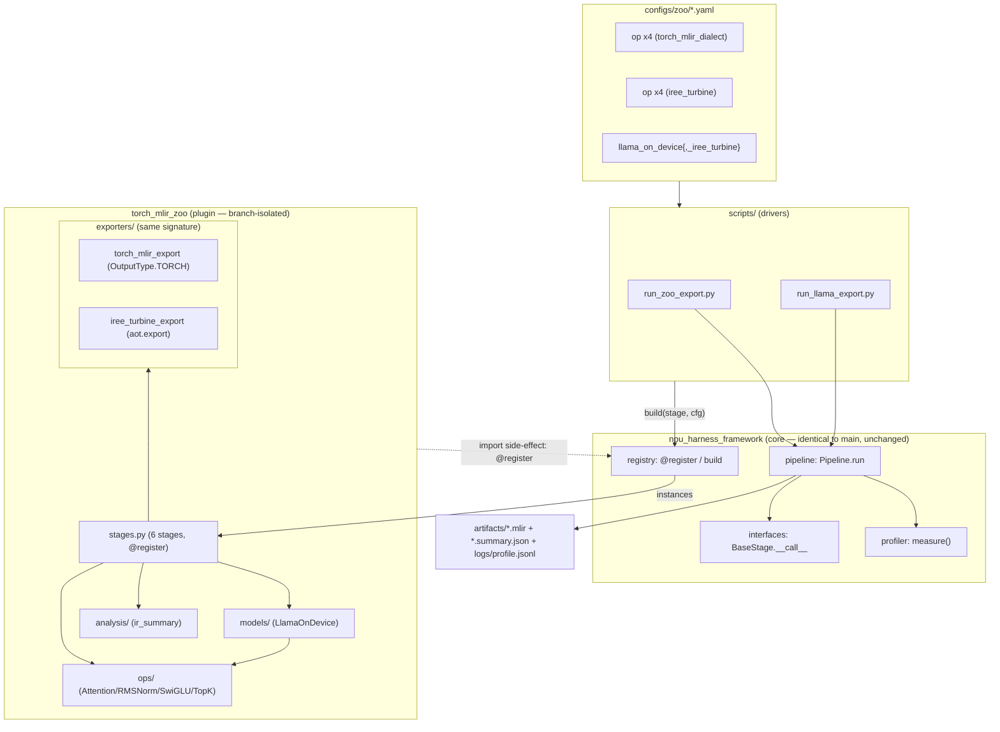
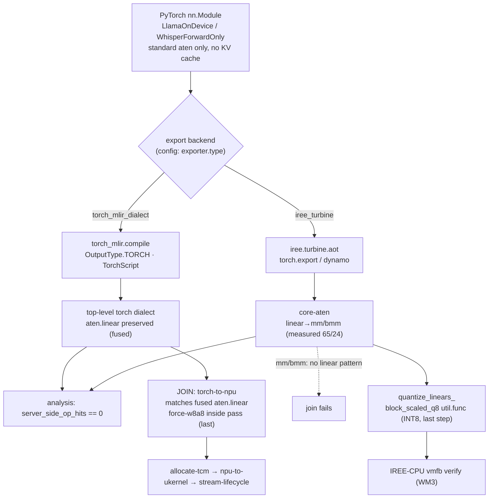

# Model Zoo — 아키텍처 (system / software / lowering)

> 같은 스택의 세 관점, 각각 소스로 실측:
> **system**(온디바이스 프론트엔드가 전달받은 NPU 런타임과 어떻게 합류하나),
> **software**(프레임워크 코드가 어떻게 구성됐나),
> **lowering**(모델이 torch-dialect MLIR이 되는 과정 + 합류가 결정되는 지점).
>
> engineering 에이전트 팀(principal-investigator / software-engineer /
> mlir-lowering-analyst)과 공동 분석. 레시피: [RECIPES.md](RECIPES.md).

---

# Part 1 — 시스템 아키텍처

## 1.1 비전: 하나의 커스텀 온디바이스 스택

`torch_mlir_model_zoo.pdf`의 "top dotted box"(PyTorch Model Zoo + Torch-MLIR +
Torch-MLIR 컴파일러)가 우리 repo가 채우는 부분 — **깨끗한 torch-dialect MLIR**를
생산하는 온디바이스 프론트엔드다. 선(line) 아래 계층들 — NPU 런타임 컴파일러
플러그인(IREE C++ dialect), SystemC NPU 모델, RISC-V VP — 은 소스로 전달받았다.
두 절반은 **torch-MLIR 경계에서 합류**한다: 우리 zoo가 런타임 컴파일러를 먹이고,
런타임의 손으로 쓴 스텁을 우리 실제 export로 교체하면 "우리 zoo + 전달받은
런타임 = 우리만의 amdsharktank"가 닫힌다.

## 1.2 계층 — 소유권과 경계

세 소유 영역이 하나의 경계(torch-dialect MLIR)에서 만난다:

| 계층 | 소유 | 책임 |
|---|---|---|
| ① PyTorch Model Zoo | 우리 | 표준 `nn.Module`만으로 된 온디바이스 모델(PagedAttention/KV-cache 없음, forward-only); 단위 op 4종 + LlamaOnDevice / WhisperForwardOnly |
| ② INT8 양자화 | 우리 | `block_scaled_q8` per-OCH symmetric INT8 (별도 관리) |
| ③ Torch-MLIR export | 우리 | 두 백엔드; **`torch_mlir.compile(OutputType.TORCH)`가 합류 백엔드** |
| ── **JOIN: torch dialect MLIR** ── | 경계 | fused `aten.linear` 보존 계약 |
| ④ NPU 컴파일러 패스 | 전달받음 | `iree-opt` 플러그인: `torch-to-npu → allocate-tcm → npu-to-ukernel → stream-lifecycle` |
| ⑤ ukernel 커맨드 스트림 | 전달받음 | `decoder_layer.mlir` `ukernel.mk_*_emit` 빌더 → 512-cmd CMEM 청크 |
| ⑥ RISC-V Linux 바이너리 | 전달받음 | NPU 커맨드 스트림 빌드/디스패치 (~575k cmd) |
| ⑦ SystemC NPU VP | 전달받음 | `npu-vp`(Qbox) + NPU 모델(tcore/tcm/dma/ctrl_fe) via `npu_runtime.so` |
| ⑧ Golden 비교 | 검증 | `x_out @ 0xF9719000` vs `expected_y_out_fp16.bin` (exact / ULP) |

경계 규칙: 우리 영역은 **표준 `torch.aten.*`만** 내보내고 서버측 primitive를 전혀
import하지 않는다(`server_side_op_hits == {}`); 전달받은 영역은 우리 IR을 그대로
소비. 유일한 계약은 Part 3의 op-레벨 계약.

## 1.3 전체 스택 데이터플로우

초록 = 우리, 빨강 = 전달받음, 파랑 = OSS 그대로, 노랑 = 합류점.

## 1.4 산출물과 불변 제약

| # | 산출물 | 스택 매핑 | 상태 |
|---|---|---|---|
| ① | naive 음성 앱(STT→LLM→TTS), GPU PyTorch | zoo 모델의 reference 소스 | ✅ (TTS swap 대기) |
| ② | PyTorch→MLIR lowering 프레임워크 | 계층 ①–③ + JOIN | ⚠ Whisper INT8 E2E ✅, Llama layer-0 합류 계약 확정 |
| ③ | SoC VP(RISC-V)의 CPU 기반 타깃 앱 | 계층 ④–⑧ | ⚠ VP/컴파일러/모델 빌드됨; layer-0 green 대기 |

스택 전반에 고정된 불변식: **2 GB DRAM budget**(프로파일러가 budget 초과 로드에
경고, INT8 양자화는 명시적 budget 예외로 진입), **CPU-only VP**(SystemC NPU 모델이
실리콘 대체), **한국어 음성 루프**, **모델 swap 프레임워크**(한 번 빌드하고
`@register` 한 줄로 모델 교체 — 프레임워크 코어는 절대 안 바뀜).

---

# Part 2 — 소프트웨어 아키텍처

## 2.1 프레임워크 코어 — `src/npu_harness_framework/` (~130 LOC, 도메인 중립)

| 모듈 | 책임 (실측) |
|---|---|
| `interfaces.py` | `BaseStage(ABC)` — **단일** `__call__(payload) -> Any`; batch/streaming/async는 의도적으로 confine. Deep module / narrow interface. |
| `registry.py` | 2단계 `_REGISTRY[stage][name] -> class`; `register()` 데코레이터; `build()`은 caller config를 비파괴 복사 후 `type`을 pop하고 나머지를 kwargs로 전달; unknown stage/type은 build-time에 즉시 실패. |
| `pipeline.py` | `Pipeline.run()`이 stage 리스트를 fold, 각각을 `measure()`로 감쌈. 비선형 토폴로지는 명시적 out-of-scope. |
| `profiler.py` | `measure()` 컨텍스트 매니저: RSS delta(`psutil`), latency, 옵셔널 GPU peak(`torch.cuda` lazy — 코어는 torch 하드 의존 없음); JSONL + stdout 1줄; `budget_mb` 초과 시 경고. |

코어는 어떤 구체 stage 클래스도 모른다; `build` / `Pipeline` / `profiler`가 네 개의
도메인 중립 primitive.

## 2.2 `torch_mlir_zoo` 패키지 — capability 레이어 (plugin)

- `__init__.py` — 패키지 import가 부수효과로 stage들을 등록(한 번의
  `import torch_mlir_zoo`로 `build(...)` 가능).
- `ops/` — 단위 op 4종(`ScaledDotProductAttention`, `RMSNorm`, `SwiGLU`, `TopK`),
  각각 표준 op로 된 순수 `nn.Module` — fused/handwritten 커널 없음 — 서버측
  amdsharktank 패턴의 온디바이스 대체물.
- `models/llama_on_device.py` — `LlamaConfig` → `LlamaAttention` → `LlamaBlock` →
  `LlamaOnDevice`(`input_ids -> logits`); KV cache/paging 없음, prefill/decode
  분리 없음, sampling 없음. `load_hf_weights`가 HF `model.` prefix strip +
  `inv_freq` 버퍼 drop.
- `exporters/` — 두 백엔드, **동일 `(module, args) -> str` 시그니처**;
  `torch_mlir_export`(`OutputType.TORCH`) vs `iree_turbine_export`(`aot.export`);
  무거운 import는 lazy라 코어+ops를 두 toolchain 없이도 테스트.
- `analysis/ir_summary.py` — regex 기반 `summarize()`(MLIR 파서 무의존), op 수,
  dtype, dynamic-dim 플래그, `server_side_op_hits` 산출.
- `stages.py` — 6개 `BaseStage` + `@register` 접착 stage(loader / 두 exporter /
  analyzer / tokenizer / model loader). 접착층은 **코어 소스를 안 건드림**.

## 2.3 설계 원칙, 코드에서

| 원칙 | 드러나는 지점 (실측) |
|---|---|
| **D1 좁은 인터페이스** | `interfaces.py` — 모든 stage가 하나의 `__call__(payload)`. |
| **D2 config-driven registry** | `registry.build()`이 유일한 구현 선택 지점; `configs/zoo/*.yaml`의 `type`이 op / 모델 / 백엔드를 한 줄로 교체. |
| **D3 횡단 프로파일러** | `Pipeline.run`이 각 stage를 `measure()`로 감쌈; stage에 프로파일링 없음; `budget_mb=2048`이 2 GB 불변식 강제. |
| **D4 브랜치 격리** | `git diff main model-zoo -- src/npu_harness_framework/` = **0줄** — zoo는 순수 additive plugin; 2번째 export 백엔드도 additive. |
| **Simplicity / Surgical (`CLAUDE.md`)** | 코어 ~130 LOC, registry = 2단계 dict, pipeline = for-fold, speculative 추상화 없음; 테스트가 실측 목표를 코드화(atol 1e-5, legal MLIR, `hits=={}`). |

## 2.4 컴포넌트 의존 관계

의존 방향: **코어는 zoo의 어떤 것에도 의존하지 않는다**(안정 코어, 가변 plugin이
코어에 의존). 확장점: 새 op = `ops/` 모듈 + `stages.py` registry 한 줄 + YAML;
새 백엔드 = `exporters/` 함수 + `@register` stage + sibling YAML(기존 백엔드 불변).

---

# Part 3 — Lowering 아키텍처

## 3.1 두 계층: export-time vs lowering-time

모든 IR은 둘 중 하나: **export-time**(trace되는 `nn.Module` → 표준
`torch.aten.*`) 또는 **lowering-time**(손으로 쓴 `util.func` 커스텀 커널, 예:
`block_scaled_q8`). 온디바이스 모델은 순수 표준 aten으로 export-time을 통과하도록
재작성돼, export 단계에서 서버측 커스텀 커널을 회피한다.

## 3.2 두 export 백엔드 — swap이 합류를 결정

같은 `(module, args) -> str`; harness가 config 한 줄(`exporter.type`)로 선택.
차이는 **어느 IR 레벨에서 trace를 멈추느냐**:

| 항목 | `torch_mlir_dialect` | `iree_turbine` |
|---|---|---|
| API | `torch_mlir.compile(OutputType.TORCH)` | `iree.turbine.aot` |
| trace 엔진 | TorchScript | torch.export / dynamo |
| IR 레벨 | top-level torch dialect | core-aten (분해됨) |
| `aten.linear` | **보존(fused)** | **분해 → `mm`/`bmm`** |
| RMSNorm / SDPA | fused 가능 | `var_mean`+`rsqrt` / `softmax` path |
| 로컬 설치(venv-shark) | 없음(offline-blocked) | 있음 |
| **NPU 합류** | **✅ (linear 매치)** | ✗ (matmul-form 패턴 없음) |

실측(turbine, `logs/whisper/whisper-tiny.mlir`): `aten.linear = 0`,
`aten.mm = 65`, `aten.bmm = 24`; RMSNorm → `var_mean`+`rsqrt`; SDPA → `_softmax`.
turbine이 패스가 필요로 하는 fused op들을 분해함을 직접 확인.

## 3.3 온디바이스 lowering — `server_side_op_hits == 0`

`analysis/ir_summary.summarize()`가 IR 텍스트에서 `SERVER_SIDE_HINTS`
(paged_attention, kv_cache, flash_attention, vllm, tensor_parallel,
device_affinity)를 카운트. 온디바이스 목표 = `{}`; 서버 reference ≥ 1.
`run_llama_export.py`는 dict가 비어있지 않으면 non-zero exit. `LlamaOnDevice`와
`WhisperForwardOnly`(4가드: eager attention, `use_cache=False`,
`return_dict=False`, fixed shape) 모두 `{}` 달성.

## 3.4 INT8 양자화 — lowering 후, 항상

두 개의 양자화 지점, **둘 다 lowering 후**:
1. **자체 검증 경로**: `quantize_linears_` → `block_scaled_q8` `util.func`
   (turbine 백엔드 위), IREE-CPU vmfb로 수치 검증. 실측(WM3,
   `logs/whisper-int8/whisper-tiny-int8.mlir`): `aten.mm 65 → 1`, 67개
   `block_scaled_q8` 호출; Linear만 양자화되고 attention `bmm=24`는 f32 유지.
2. **합류 경로**: `torch-to-npu` 패스가 스스로 **force-w8a8**을 수행 — 우리는
   f16 fused IR만 넘기고 양자화는 패스 내부에서 마지막에 처리.

## 3.5 합류 계약 (op 레벨)

합류 = torch-dialect 경계. 패스는 현재 손으로 쓴 단일-layer 스텁을 매치; 캡스톤은
그 자리에 우리 `LlamaOnDevice` layer를 투입. 계약(스텁 + `TorchToNPU.cpp`):

| torch op | 패스 매치 | 비고 |
|---|---|---|
| `aten.linear` | ✅ (`mm`/`matmul` 패턴 없음) | **fused 유지 필수 (rigid)** |
| `aten.rms_norm` | ✅ 및 분해형(`rsqrt`+`mean.dim`+`pow`) | 유연 |
| `aten.scaled_dot_product_attention` | ✅ 및 분해형(`softmax`) | 유연 |
| `silu`/`mul`/`add`/`cat`/`neg`/`slice`/`view`/`transpose` | ✅ | RoPE + SwiGLU primitive |

유일한 rigid 요건: **`aten.linear` 보존** → 합류 백엔드 =
`torch_mlir.compile(OutputType.TORCH)`; turbine(linear→mm)은 매치 불가.

## 3.6 stock `LlamaBlock` → 계약 델타 (작고 기계적)

| 항목 | stock `LlamaBlock` | 계약 | 변경 |
|---|---|---|---|
| RoPE cos/sin | 내부 buffer | **forward args** | cos/sin 배선 |
| RoPE 적용 | B-H-S-D (transpose 후) | B-T-H-D (transpose 전) | apply를 transpose 앞으로 |
| attention | 수동 matmul+mask+softmax | fused SDPA | (패스는 수동형도 수용) |
| 단위 | 16-layer 전체 모델 | 단일 layer | `LlamaBlock` 하나만 export |
| dtype | fp32 | f16 | `.half()` |

계약 layer는 zoo op(RMSNorm + SDPA + SwiGLU + RoPE)로 조립하며, 실제 합류 IR은
**torch_mlir 백엔드**(`export_top_level_torch_dialect`)로 생산해야 `aten.linear`가
보존된다. zoo op만으로 조립한 예시는 `tests/test_iree_cpu_numeric.py`의
`_DecoderBlock` 참조.

---

# Part 4 — 한눈에 보는 상태

| 항목 | 소유 | 상태 | 근거 |
|---|---|---|---|
| 프레임워크 코어(interfaces/registry/pipeline/profiler) | 우리 | ✅ | `git diff main` 코어 = 0줄 |
| 온디바이스 모델 + 단위 op 4종 | 우리 | ✅ | `server_side_op_hits == {}` |
| 두 export 백엔드 | 우리 | ✅ | zoo + turbine export 테스트 통과 (21 passed / 3 skipped) |
| **합류 백엔드 결정** | 우리 | ✅ | `torch_mlir.compile`이 `aten.linear` 보존 (turbine 분해는 실측) |
| 캡스톤 계약-layer export | 우리 | ✅ 템플릿 | `export_capstone_layer.py`가 clean export |
| INT8 `block_scaled_q8` | 우리 | ✅ | WM3 vmfb 검증 (별도 관리) |
| NPU SystemC 모델 / iree-opt+plugin / 전체 VP | 전달받음 | ✅ 빌드됨 | ctest 19/25; `--show-dialects`; `npu-vp` |
| **캡스톤 e2e lowering 증명** | 경계 | ⏳ | prebuilt torch-mlir 휠 ↔ torch ABI skew (정확 nightly pruned) → 소스빌드 필요 |
| **layer0_verify.sh e2e** | 전달받음 | ⛔ | `/dev/npu0` 드라이버 부재 + TCM allocator 블로커에 의존 |
