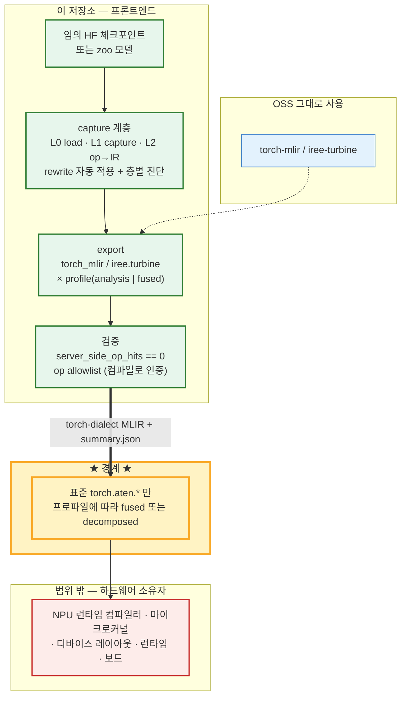
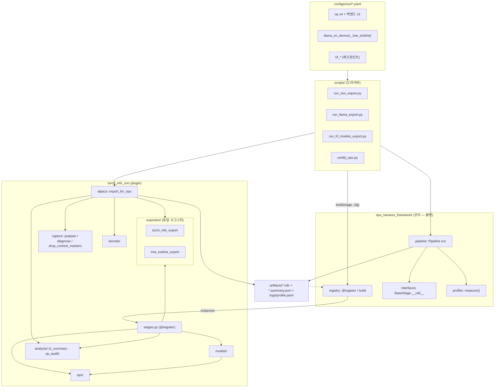
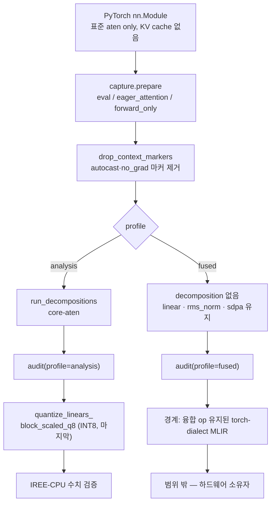

# Model Zoo — 아키텍처 (system / software / lowering)

> 같은 스택의 세 관점, 각각 소스로 실측:
> **system**(이 프론트엔드가 스택 어디에 있고 무엇을 보장하나),
> **software**(프레임워크 코드가 어떻게 구성됐나),
> **lowering**(모델이 torch-dialect MLIR이 되는 과정 + 융합이 결정되는 지점).
>
> 공개/비공개 경계는 [SCOPE.md](SCOPE.md). 재현 명령은 [RECIPES.md](RECIPES.md).
> 처음이면 [GETTING-STARTED.md](GETTING-STARTED.md)부터.

---

# Part 1 — 시스템 아키텍처

## 1.1 이 저장소가 스택에서 차지하는 자리

온디바이스 NPU 스택은 크게 두 절반이다. **위쪽**은 PyTorch 모델을 표준 IR로
내리는 프론트엔드, **아래쪽**은 그 아래 어딘가에서 하드웨어 코드를 만드는 런타임
컴파일러다. 이 저장소는 **위쪽 절반만** 다룬다.

프론트엔드가 하는 일은 한 문장으로 정리된다:

> 임의의 PyTorch 모델을 **서버측 패턴이 하나도 없는 표준 torch-dialect MLIR**로
> 바꾸고, 그 사실을 매 export마다 기계로 증명한다.

"기계로 증명한다"가 핵심이다. 이 저장소의 산출물은 IR 파일이 아니라 **IR + 그
IR의 성질에 대한 검증된 진술**이다 — `server_side_op_hits == {}`, op allowlist
통과, 프로파일별 op 히스토그램.

## 1.2 계층 — 소유권과 경계

| 계층 | 소유 | 책임 |
|---|---|---|
| ① PyTorch Model Zoo | 이 저장소 | 표준 `nn.Module`만으로 된 온디바이스 모델(PagedAttention/KV-cache 없음, forward-only) — 단위 op 4종 + `LlamaOnDevice` + `WhisperForwardOnly` |
| ② capture 계층 | 이 저장소 | 임의 HF 체크포인트를 트레이스 가능한 형태로 만들고, 실패를 L0/L1/L2로 진단 |
| ③ Torch-MLIR export | 이 저장소 | 두 백엔드 × 두 프로파일 |
| ④ 계약 검증 | 이 저장소 | `server_side_op_hits == 0` · allowlist · 히스토그램 |
| ⑤ INT8 커널 | 이 저장소 | `block_scaled_q8` · `fused_rmsnorm` CustomOp (lowering *후* 적용) |
| ── **경계 = torch-dialect MLIR** ── | | |
| ⑥ NPU 런타임 컴파일러 · 마이크로커널 · 런타임 | 하드웨어 소유자 | **범위 밖** ([SCOPE.md](SCOPE.md)) |

**경계 규칙.** 이 저장소는 표준 `torch.aten.*`만 내보내고 서버측 primitive를 전혀
import하지 않는다. 경계 아래가 이 IR을 어느 레벨에서 받아 무엇을 하는지는 각 통합의
계약 문제이며, 이 저장소가 검증할 수 있는 범위가 아니다 — 그래서 주장하지 않는다.

## 1.3 데이터플로우


```mermaid
flowchart TB
  subgraph OURS["이 저장소 — 프론트엔드"]
    direction TB
    hf["임의 HF 체크포인트<br/>또는 zoo 모델"]
    cap["capture 계층<br/>L0 load · L1 capture · L2 op→IR<br/>rewrite 자동 적용 + 층별 진단"]
    exp["export<br/>torch_mlir / iree.turbine<br/>× profile(analysis | fused)"]
    aud["검증<br/>server_side_op_hits == 0<br/>op allowlist (컴파일로 인증)"]
    hf --> cap --> exp --> aud
  end
  aud ==>|"torch-dialect MLIR + summary.json"| BOUND
  subgraph BOUNDBOX["★ 경계 ★"]
    BOUND["표준 torch.aten.* 만<br/>프로파일에 따라 fused 또는 decomposed"]
  end
  BOUND --> down
  subgraph DOWN["범위 밖 — 하드웨어 소유자"]
    down["NPU 런타임 컴파일러 · 마이크로커널<br/>· 디바이스 레이아웃 · 런타임 · 보드"]
  end
  subgraph OSS["OSS 그대로 사용"]
    tools["torch-mlir / iree-turbine"]
  end
  tools -.-> exp
  classDef ours fill:#e7f6ec,stroke:#2e7d32,stroke-width:2px;
  classDef down fill:#fdecea,stroke:#c62828,stroke-width:2px;
  classDef oss  fill:#e3f2fd,stroke:#1565c0;
  classDef bd   fill:#fff3c4,stroke:#f9a825,stroke-width:3px;
  class hf,cap,exp,aud ours;
  class down down;
  class tools oss;
  class BOUND,BOUNDBOX bd;
```

초록 = 이 저장소, 빨강 = 범위 밖, 파랑 = OSS 그대로, 노랑 = 경계.

## 1.4 스택 전반의 불변 제약

| 불변식 | 강제되는 지점 |
|---|---|
| **서버측 패턴 0** | `analysis/ir_summary`가 매 export마다 카운트; 비면 통과 |
| **forward-only** | `capture.ForwardOnly`가 `use_cache=False` / `return_dict=False` 강제 |
| **정적 shape** | `example_args`가 shape을 고정; dynamic dim 미사용 |
| **2 GB 메모리 budget** | `profiler.measure(budget_mb=2048)`가 초과 시 경고 + JSONL 기록 |
| **모델 swap = config 한 줄** | `registry.build()`이 유일한 구현 선택 지점 |
| **양자화는 마지막** | INT8은 lowering이 올바른 *뒤에만*; 메모리 지름길로 쓰지 않음 |

---

# Part 2 — 소프트웨어 아키텍처

## 2.1 코어 — `src/npu_harness_framework/` (~130 LOC, 도메인 중립)

| 모듈 | 책임 |
|---|---|
| `interfaces.py` | `BaseStage(ABC)` — **단일** `__call__(payload) -> Any`. batch/streaming/async는 의도적으로 배제. Deep module / narrow interface. |
| `registry.py` | 2단계 `_REGISTRY[stage][name] -> class`; `register()` 데코레이터; `build()`은 caller config를 비파괴 복사 후 `type`을 pop하고 나머지를 kwargs로 전달. unknown stage/type은 build-time 즉시 실패. |
| `pipeline.py` | `Pipeline.run()`이 stage 리스트를 fold, 각각을 `measure()`로 감쌈. 비선형 토폴로지는 명시적 out-of-scope. |
| `profiler.py` | `measure()` 컨텍스트 매니저 — RSS delta(`psutil`), latency, 옵셔널 GPU peak(`torch.cuda` lazy import라 코어는 torch 하드 의존 없음). JSONL + stdout 1줄. `budget_mb` 초과 시 경고. |

코어는 어떤 구체 stage 클래스도 모른다. `build` / `Pipeline` / `measure` /
`BaseStage` 네 개가 전부다.

## 2.2 `torch_mlir_zoo` — capability 레이어 (plugin)

| 모듈 | 내용 |
|---|---|
| `alpaca.py` | SDK 파사드 — `export_for_npu(model, args)` 한 줄 진입점. 프로파일·백엔드·양자화·rewrite를 하나의 함수 시그니처로 묶는다 |
| `capture.py` | **L1 계층** — rewrite 자동 적용(`prepare`), 실패 진단(`diagnose`), export 시점 컨텍스트 마커 제거(`drop_context_markers`) |
| `ops/` | 단위 op 4종 — `ScaledDotProductAttention` · `RMSNorm` · `SwiGLU` · `TopK`. 전부 표준 op만 쓰는 순수 `nn.Module` |
| `models/` | `LlamaOnDevice`(forward-only) · `WhisperForwardOnly` · `hf` 로더(가중치 전부 materialize, tied-embedding 복구) |
| `exporters/` | 두 백엔드, **동일 `(module, args) -> str` 시그니처**. 무거운 import는 lazy |
| `kernels/` | `block_scaled_q8` · `fused_rmsnorm` CustomOp + 이식 가능한 linalg 마이크로커널, 임베딩/tied-head 양자화 |
| `analysis/` | `ir_summary`(op 히스토그램 + `server_side_op_hits`) · `op_audit`(allowlist 게이트, 프로파일별) |
| `eval/` | forward-only perplexity — 양자화 전후 언어모델 수준 정확도 |
| `stages.py` | `BaseStage` 6종 + `@register` 접착. **코어 소스를 안 건드린다** |
| `cli.py` | `alpaca` CLI — `models` / `export` / `audit` |

## 2.3 설계 원칙, 코드에서

| 원칙 | 드러나는 지점 |
|---|---|
| **D1 좁은 인터페이스** | `interfaces.py` — 모든 stage가 하나의 `__call__(payload)` |
| **D2 config-driven registry** | `registry.build()`이 유일한 구현 선택 지점; `configs/zoo/*.yaml`의 `type` 한 줄이 op / 모델 / 백엔드를 교체 |
| **D3 횡단 프로파일러** | `Pipeline.run`이 각 stage를 `measure()`로 감쌈. stage 안에는 프로파일링 코드가 없다 |
| **D4 additive plugin** | zoo는 코어에 diff 0인 순수 additive plugin. 두 번째 export 백엔드도 additive로 들어왔다 |
| **D5 실패는 진단한다** | export 실패는 traceback이 아니라 `Diagnosis(layer, cause, hint)`. 층을 틀리면 며칠을 잃는다 |
| **Simplicity / Surgical** | 코어 ~130 LOC, registry = 2단계 dict, pipeline = for-fold. speculative 추상화 없음 |

## 2.4 컴포넌트 의존 관계


```mermaid
flowchart TB
    subgraph cfg["configs/zoo/*.yaml"]
        y1["op x4 × 백엔드 x2"]
        y2["llama_on_device{,_iree_turbine}"]
        y3["hf_* (체크포인트)"]
    end
    subgraph scr["scripts/ (드라이버)"]
        s1["run_zoo_export.py"]
        s2["run_llama_export.py"]
        s3["run_hf_models_export.py"]
        s4["certify_ops.py"]
    end
    subgraph core["npu_harness_framework (코어 — 불변)"]
        reg["registry: @register / build"]
        base["interfaces: BaseStage.__call__"]
        pipe["pipeline: Pipeline.run"]
        prof["profiler: measure()"]
    end
    subgraph zoo["torch_mlir_zoo (plugin)"]
        alp["alpaca: export_for_npu"]
        cap["capture: prepare / diagnose / drop_context_markers"]
        st["stages.py (@register)"]
        ops["ops/"]
        mdl["models/"]
        krn["kernels/"]
        subgraph exp["exporters/ (동일 시그니처)"]
            e1["torch_mlir_export"]
            e2["iree_turbine_export"]
        end
        an["analysis/ (ir_summary · op_audit)"]
    end
    art["artifacts/*.mlir + *.summary.json + logs/profile.jsonl"]
    cfg --> scr
    scr --> pipe
    scr --> alp
    scr -->|"build(stage, cfg)"| reg
    zoo -.->|"import 부수효과: @register"| reg
    reg -->|"instances"| st
    pipe --> base
    pipe --> prof
    alp --> cap
    alp --> exp
    alp --> an
    alp --> krn
    st --> ops
    st --> mdl
    st --> exp
    st --> an
    mdl --> ops
    pipe --> art
    alp --> art
```

의존 방향: **코어는 zoo의 어떤 것에도 의존하지 않는다.** 확장점 — 새 op =
`ops/` 모듈 + `stages.py` 한 줄 + YAML; 새 백엔드 = `exporters/` 함수 + `@register`
stage + sibling YAML. 기존 것은 불변.

---

# Part 3 — Lowering 아키텍처

## 3.1 실패는 세 층에 있다

임의의 HF 체크포인트를 넣으면 대부분의 시간은 export가 아니라 **왜 export가 안 되는지**
알아내는 데 쓰인다. `capture.py`는 그 진단을 층으로 나눈다:

| 층 | 무엇이 깨졌나 | 전형적 신호 |
|---|---|---|
| **L0 load** | 가중치가 애초에 materialize 안 됨 | meta device 잔류, tied-embedding 한쪽만 저장된 체크포인트 |
| **L1 capture** | `torch.export`가 그래프를 못 만듦 | `forward` 안 `nn.ModuleList` 슬라이싱, HF wrapper 객체, 값 의존 shape |
| **L2 op→IR** | 잡힌 op에 torch-dialect lowering이 없음 | SDPA/flash가 불투명 composite 하나로 뭉침 |

`diagnose(exc)`가 예외를 이 셋 중 하나로 분류하고 **구체적 처방**을 붙인다. 분류
안 되면 `unclassified`로 두고 시그니처를 추가하라고 말한다 — 조용히 넘어가지 않는다.

`prepare(model)`는 측정으로 확인된 rewrite만 적용한다: `eval_mode`,
`eager_attention`(SDPA 분해가 필요할 때), `forward_only`(`use_cache=False` +
`return_dict=False` + 단일 텐서 반환).

## 3.2 두 백엔드 — 지금은 사실상 하나

같은 `(module, args) -> str`; config 한 줄로 선택한다.

| 항목 | `torch_mlir_dialect` | `iree_turbine` |
|---|---|---|
| API | `torch_mlir.compile(OutputType.TORCH)` | `iree.turbine.aot` |
| trace 엔진 | TorchScript | `torch.export` / dynamo |
| 캡처 전략 | 단일 경로 | nonstrict → strict 자동 사다리 |
| 설치 | **불가** — 배포 wheel 인덱스가 2024-01에 멈췄고 해석되지 않는 torch nightly를 pin | 가능 |

> `torch_mlir` 백엔드는 완결성을 위해 남아 있지만 호출하면
> `ModuleNotFoundError`다. **실질 백엔드는 `iree_turbine` 하나**이며, 아래 §3.3이
> 왜 그래도 괜찮은지를 설명한다.

## 3.3 융합을 결정하는 것은 백엔드가 아니라 프로파일이다

> **정정.** 이 저장소의 예전 문서는 "fused `aten.linear`를 보존하려면 torch-mlir
> 백엔드를 써야 하고 turbine은 `linear → mm`으로 분해해서 못 쓴다"고 적었다.
> **그 진술은 틀렸다.** turbine이 분해하는 주체는 importer가 아니라 export *후*에
> 도는 `run_decompositions()`다. 그것만 건너뛰면 pre-dispatch aten이 그대로 남는다.

그래서 프로파일이 둘이고, 둘은 의도적으로 반대다:

| 프로파일 | decomposition | 한 decoder layer 실측 | 용도 |
|---|---|---|---|
| `analysis` (기본) | turbine 기본 테이블 | 98 ops / 25종 (`linear`→`mm`, `rms_norm`→pow·mean·rsqrt, SDPA→bmm·softmax) | op audit · IREE-CPU 실행 검증 |
| `fused` | **없음** | **37 ops / 12종** (`linear` 7 · `rms_norm` 2 · SDPA 1 유지) | 융합 op을 매치하는 하위 패턴 매처 |

```python
export_for_npu(model, args, profile="fused")   # 융합 op 유지
```

`analysis`가 "더 나쁜 IR"인 게 아니다. **소비자가 다르다.** 융합 op 하나가
하드웨어 커널 하나에 대응하는 소비자에게는 `fused`가, 어떤 백엔드도 내릴 수 있는
표준 primitive를 원하는 감사에는 `analysis`가 맞다.

프로파일은 감사에도 전파된다 — `audit(mlir, profile=...)`가 프로파일별 allowlist를
쓴다. `analysis`에서 정상인 `mm`이 `fused`에서는 "분해가 새어나왔다"는 신호다.

## 3.4 컨텍스트 마커 — `fused`가 밟는 유일한 함정

`fused`는 `run_decompositions`를 건너뛰므로, 그 부작용으로 HF `forward` 안의
`with torch.autocast(...)` · `with torch.no_grad()` 영역이 살아남는다.
`torch.export`는 이 영역을 higher-order op으로 감싸고, fx_importer는 그것을 거부한다:

```
NotImplementedError: Higher-order operation 'wrap_with_autocast'
```

`analysis`는 `run_decompositions`가 HOP을 녹여서 이 문제를 만나지 않는다. 즉
**커널 갭이 아니라 캡처 계층의 갭**이다.

**해법은 인라인이 아니라 삭제다.** HOP은 `torch.export._trace`가 부르는
`replace_{autocast,set_grad}_with_hop_pass`가 만든다. 그 pass 앞에 마커 노드
(`_enter_autocast` · `_exit_autocast` · `_set_grad_enabled`)를 지우는 단계를 끼우면
HOP이 애초에 생기지 않는다 — `capture.drop_context_markers()`. aten op을 하나도
건드리지 않으므로 융합은 그대로다.

지울 수 있는 마커와 없는 마커를 나눈다:

| 마커 | 지우나 | 왜 |
|---|---|---|
| `_set_grad_enabled(...)` | ✅ | grad 모드는 forward 값을 바꾸지 않는다 |
| `_enter/_exit_autocast(..., enabled=False, ...)` | ✅ | 끄는 블록이므로 no-op |
| `_enter_autocast(..., enabled=True, ...)` | ❌ | 지우면 내부 dtype이 조용히 바뀐다. HOP으로 남겨 **시끄럽게 실패**시킨다 |

지우지 못한 마커는 torch 원래 pass로 넘긴다. 소비되지 않은 마커는 verifier가
`missing val field`로 거부하므로 "그냥 건너뛰기"는 선택지가 아니다.

`analysis` 프로파일의 IR은 이 pass 적용 전후로 **바이트 동일**이다. 그래서
프로파일 분기 없이 항상 적용한다.

## 3.5 온디바이스 lowering — 두 개의 게이트

**게이트 1 — `server_side_op_hits == 0`.** `ir_summary.summarize()`가 IR 텍스트에서
`paged_attention` · `kv_cache` · `flash_attention` · `vllm` · `tensor_parallel` ·
`device_affinity` 흔적을 센다. 온디바이스 목표는 `{}`이고, 서버 reference는 ≥ 1이
나온다 — 게이트가 빨간불이 될 수 있음을 보이는 대조군이다.

**게이트 2 — op allowlist.** 등재 기준이 문서가 아니라 **컴파일**이다.
`scripts/certify_ops.py`가 op별 최소 probe를 export하고 CPU vmfb까지 컴파일해야
allowlist에 오른다. 컴파일되지 않는 op은 "지원한다"고 적을 수 없다.

allowlist는 프로파일별이다. HF 체크포인트 12개 실측:

| 게이트 | `analysis` | `fused` |
|---|---|---|
| export | 12/13 | 12/13 |
| `server_side_op_hits == 0` | 12/12 | 12/12 |
| op allowlist | 12/12 통과 | 12/12 통과 |

`fused` 쪽은 한동안 **0/12**였다. `dropout`(12개 전부) · `layer_norm`(7개) ·
`conv1d`(whisper)가 미등재였기 때문인데, 서버측 op 유출이 아니라 **인증 자체가
한 번도 없었던** 것이다 — 이 op들은 `analysis`에서 `run_decompositions`가 없애버려
감사에 아예 나타나지 않고 `fused`에서만 살아남는다. 게이트가 프로파일별로 갈리는데
probe는 한쪽만 있었던 셈이다.

셋 다 같은 기준으로 인증했다: fused 프로파일 probe → export → CPU vmfb 컴파일
(`dropout` 1,525 B · `layer_norm` 10,211 B · `conv1d` 10,563 B). 등재는 **"깨끗하게
내려간다"는 뜻이지 "타깃에 커널이 있다"는 뜻이 아니다.** `dropout`은 eval에서 항등
이라 실행 비용이 없고, `layer_norm`·`conv1d`는 실제 연산이다.

## 3.6 두 계층: export-time vs lowering-time

모든 IR은 둘 중 하나다. **export-time** — 트레이스되는 `nn.Module`이 표준
`torch.aten.*`가 되는 경로. **lowering-time** — 손으로 쓴 `util.func` 커스텀 커널
(예: `block_scaled_q8`). 온디바이스 모델은 순수 표준 aten으로 export-time을
통과하도록 작성돼, export 단계에서 서버측 커스텀 커널을 회피한다.

CustomOp은 L0/L1/L2 어디에도 속하지 않는다. 표준 표현이 **아예 없는** op에만
들어가는 별도 수단이다.

## 3.7 INT8 양자화 — lowering 후, 항상

두 개의 양자화 지점, 둘 다 lowering 후:

1. **자체 검증 경로** — `quantize_linears_` → `block_scaled_q8` `util.func`,
   IREE-CPU vmfb로 수치 검증. Linear만 양자화되고 attention `bmm`은 f32로 남는다.
2. **하위 위임** — `fused` 프로파일은 양자화하지 않는다. 융합 `aten.linear`를
   매치하는 하위 패스가 자기 방식으로 w8a8을 하기 때문이다. `export_for_npu`는
   `profile="fused"` + `quantize="int8"` 조합을 **에러로 막는다** — 양자화하면
   `aten.linear`가 전부 `block_scaled_q8` 호출로 바뀌어 패턴 매처가 아무것도 못 찾는다.

`block_scaled_q8`의 `headroom`은 블록 최대값을 int8 범위로 매핑하는 제수다. 127은
전 범위를 쓰고, 더 작은 값은 위쪽을 비워 하위 누산기가 넘치지 않게 한다 — 얼마나
비울지는 그 누산기의 성질이지 이 함수의 성질이 아니다.

## 3.8 예시 — 단일 decoder layer를 계약 shape으로

하위 통합에서 흔한 단위는 모델 전체가 아니라 **decoder layer 한 장**이다. zoo op
(RMSNorm + SDPA(GQA) + SwiGLU + RoPE)로 조립하고 `fused` 프로파일로 export한다.

Llama-3.2-1B 기준 shape:
`decoder_layer(hidden[1,32,2048]f16, cos[1,32,1,64]f16, sin[1,32,1,64]f16) → [1,32,2048]f16`,
GQA 32/8(group 4), seq 32.

stock `LlamaBlock`과의 델타는 작고 기계적이다:

| 항목 | stock `LlamaBlock` | 계약 | 변경 |
|---|---|---|---|
| RoPE cos/sin | 내부 buffer | **forward args** | cos/sin 배선 |
| RoPE 적용 | B-H-S-D (transpose 후) | B-T-H-D (transpose 전) | apply를 transpose 앞으로 |
| 단위 | 16-layer 전체 모델 | 단일 layer | `LlamaBlock` 하나만 export |
| dtype | fp32 | f16 | `.half()` |

zoo op만으로 조립한 예시는 `tests/test_iree_cpu_numeric.py`의 `_DecoderBlock`.


```mermaid
flowchart TD
    M["PyTorch nn.Module<br/>표준 aten only, KV cache 없음"] --> CAP["capture.prepare<br/>eval / eager_attention / forward_only"]
    CAP --> CM["drop_context_markers<br/>autocast·no_grad 마커 제거"]
    CM --> P{"profile"}
    P -->|analysis| DEC["run_decompositions<br/>core-aten"]
    P -->|fused| KEEP["decomposition 없음<br/>linear · rms_norm · sdpa 유지"]
    DEC --> A1["audit(profile=analysis)"]
    KEEP --> A2["audit(profile=fused)"]
    A1 --> Q["quantize_linears_<br/>block_scaled_q8 (INT8, 마지막)"]
    Q --> IREE["IREE-CPU 수치 검증"]
    A2 --> B["경계: 융합 op 유지된 torch-dialect MLIR"]
    B --> OUT["범위 밖 — 하드웨어 소유자"]
```

---

# Part 4 — 한눈에 보는 상태

| 항목 | 상태 | 근거 |
|---|---|---|
| 프레임워크 코어 (interfaces/registry/pipeline/profiler) | ✅ | zoo가 코어에 diff 0인 additive plugin |
| 온디바이스 모델 + 단위 op 4종 | ✅ | `server_side_op_hits == {}` |
| capture 계층 (L0/L1/L2 진단 + rewrite) | ✅ | `tests/test_capture.py` |
| 컨텍스트 마커 제거 | ✅ | 마커 있는 모델도 `fused`로 export; `analysis` IR은 전후 바이트 동일 |
| 두 프로파일 (analysis / fused) | ✅ | 한 decoder layer 98/25 vs 37/12 |
| 두 export 백엔드 | ⚠ | 시그니처는 둘 다 있으나 `torch_mlir` wheel은 설치 불가 — 실질 단일 |
| op allowlist 인증 (`analysis`) | ✅ | `certify_ops.py`가 export + CPU vmfb 컴파일까지; HF 12/12 통과 |
| op allowlist 인증 (`fused`) | ✅ | HF 12/12 — `dropout`·`layer_norm`·`conv1d`를 fused probe로 인증. §3.5 |
| INT8 `block_scaled_q8` | ✅ | IREE-CPU 수치 검증, `fused` 프로파일과는 상호 배타 |
| 하위 런타임 통합 | — | **범위 밖** ([SCOPE.md](SCOPE.md)) |
